<h3><code>rajdeep@github ~ $ whoami</code></h3>

<table>
  <tr>
    <td valign="top"></td>
    <td valign="top"></td>
  </tr>
</table>

 
 

<h3><code>rajdeep@github ~ $ ./contributions.sh</code></h3>

 
 

<h3><code>rajdeep@github ~ $ ./connect.sh</code></h3>

<b>Student / Aspiring Software Engineer · Problem Solver · Open Source Enthusiast</b>

 

